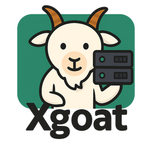

# Xgoat

Xgoat 是一款简洁的服务器管理工具，支持以下功能：

- 文件同步（支持自动/手动模式）
- MySQL 数据库管理（创建/删除库和表，执行 SQL）
- 一键安装 MySQL（支持 5.7 / 8.0 等版本）
- SSH 远程连接，支持密码和私钥登录

## 使用方法

1. 下载发布页的编译版本（Windows/Linux）
2. 启动后输入服务器连接信息
3. 选择文件进行同步，或进入 **数据库管理** 标签页操作 MySQL

## 开源说明

- 本仓库开源 **UI 层代码**，核心逻辑通过编译产物提供。
- 图标文件：`icon.png`（Xgoat 项目 LOGO）
---
MIT License
